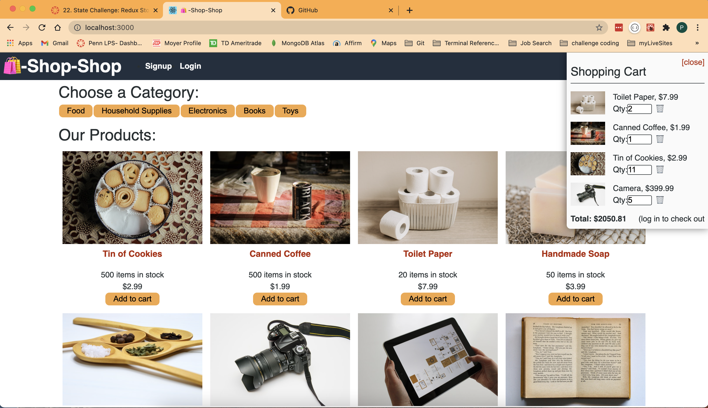

# shop-shop

## Description

Shop-Shop is an e-commerce React.js application that uses Redux to handle a global state "store", to make it easier to handle state changes accross all of the components in the application.
This app also uses stripe npm package to handle purchasing products, as well as IndexedDB to provide offline functionality.

## Table of Contents

- [Technologies](#Technologies)
- [Usage](#usage)
- [Credits](#credits)
- [Questions](#questions)

## Technologies

  
  
  
  
  
  
  
  

## Screenshots

> 

## Usage

All you need to do is go to https://shopshopshop28.herokuapp.com/ and you will be able to log in and start using that app

## Questions

If you have any questions you can visit my github profile at <https://github.com/pschlafley/Tech-Blog>
or you can email me at <pschlafely0@gmail.com>
